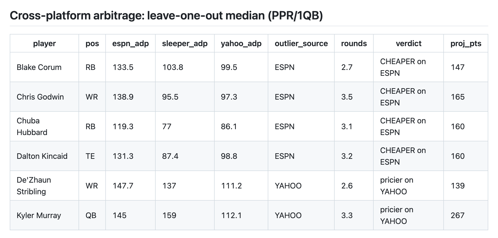

# Fantasy Football ADP Comparison Tool

Pulls Average Draft Position from ESPN, Sleeper, and Yahoo, reconciles them onto one player identity, and surfaces where the platforms disagree — so you can find players who are systematically cheaper wherever you happen to be drafting.

## See it without cloning anything

**[REPORT.md](./REPORT.md)** is regenerated every morning by an automated ingest and renders as an ordinary page right here on GitHub — cross-platform arbitrage, value board, tiers, and strength of schedule, already computed. Nothing to install, nothing to click; it stays current on its own schedule.



The table above is straight from REPORT.md, not a mockup — that's the actual daily output. Want a specific day instead of the latest? **Actions tab → "Daily ADP ingest" → any run → Summary** (works signed into any GitHub account; logged out, use REPORT.md).

Only clone this if you want to run your own queries against it — different round ranges, different rising windows, offline. That's everything below. CLI only, no API keys, no accounts, nothing to configure.

## Requirements

- **Node ≥ 22** (`node --version`)
- Nothing else — every source is a public, unauthenticated API

## Setup

```bash
git clone <repo> && cd fantasy-adp
npm install
npm run ingest      # REQUIRED FIRST — see below
```

**`npm run ingest` is not optional on a fresh clone.** The DuckDB file lives in `data/gold/` and is gitignored, so it doesn't come with the repo. `ingest` rebuilds it from the committed Parquet history in `data/silver/` and then fetches today's numbers. The report commands read that database directly and *do not* hydrate it themselves — run them first and they'll stop and tell you to ingest.

Takes ~5-10s. After that, everything below works offline against the local database.

## Commands

| Command | What it gives you |
|---|---|
| `npm run values [POS] [MIN] [MAX]` | Value board — players whose projected production beats their draft slot. Defaults to rounds 4-10 |
| `npm run tiers [POS]` | Positional tiers clustered by ADP, with the point cliff between them |
| `npm run sos [POS]` | Strength of schedule — the 5 easiest and 5 hardest playoff draws |
| `npm run rising [POS] [DAYS]` | ADP movement over the last `DAYS` (default 7). A lone number is `DAYS`: `npm run rising 14` |
| `npm run report` | Integrity checks, resolution quality, and cross-platform arbitrage |
| `npm run ingest` | Fetch all sources → DuckDB + Parquet |
| `npm run verify:capture` | Assert today's ADP reached the committed history. Run by CI after each ingest |

Position defaults to all (or QB for `tiers`), so a bare `npm run values` works.

```bash
npm run values RB 6 10    # RBs going in rounds 6-10
npm run tiers TE          # TE tiers
npm run sos RB            # RB schedules
npm run rising WR 14      # WR movement over 14 days
```

## Flags

| Flag | Command | What it does |
|---|---|---|
| `--all` | `tiers` | Include undrafted players, not just the drafted pool |
| `--weight=0..1` | `tiers` | Blend projections into tier boundaries. `0` (default) is pure ADP, `1` pure projection |
| `--markdown` | `report` `values` `sos` `rising` | Markdown tables instead of box-drawing. The `:md` scripts (`npm run values:md`) are shorthand |
| `--dry-run` | `ingest` | Fetch and resolve without writing — aliased as `npm run ingest:dry`. Good for checking a source hasn't broken before it touches anything |
| `--refresh-sos` | `ingest` | Force strength of schedule to recompute. Normally populated once per season and skipped, since SOS is fixed once the schedule is out |

> ⚠️ npm swallows a bare `--all` as one of its own flags. Both `npm run tiers RB --all` and `npm run tiers RB -- --all` are honoured.

## Reading the output

### values

```
league: 12-team PPR, 1QB/2RB/2WR/1TE/1FLEX
replacement level:  RB   RB26 baseline, 184 pts   ...

RB · rounds 6-8 · A/B value plays, alphabetical:
┌───────────────────────┬──────┬───────┬────────────┬───────────────┬───────┬──────────┬─────────────┐
│ player                │ adp  │ round │ drafted_as │ produces_like │ grade │ espn_pts │ sleeper_pts │
├───────────────────────┼──────┼───────┼────────────┼───────────────┼───────┼──────────┼─────────────┤
│ 'Rhamondre Stevenson' │ 81   │ 7.7   │ 'RB28'     │ 'RB25'        │ 'B'   │ '203'    │ '169'       │
└───────────────────────┴──────┴───────┴────────────┴───────────────┴───────┴──────────┴─────────────┘
```

- **`drafted_as` vs `produces_like`** — his rank by ADP against his rank by production. The gap is the story.
- **`grade`** — the point edge curved within his own position. A/B = top ~30%.
- **`espn_pts` / `sleeper_pts`** — each source's own number, shown raw rather than averaged, so you see model disagreement directly.

> **An empty or short board is a normal result, not a bug.** Only A/B players appear, there's no fixed row count, and at the top of a position ADP and production already agree. Players also need 2+ projection sources, an ADP inside 13 rounds, and a projection above replacement level. Each filter exists because of a specific false positive — see the comments and regression tests in `src/metrics/vorp.ts` and `src/metrics/replacement.test.ts`.

### tiers

Clusters by **ADP, not projected points** — points alone put every elite RB in a tier of one, while ADP matches how drafters actually group them. Tier count scales to the pool automatically and isn't settable.

### sos

Two tables per position, easiest and hardest, one row per team.

- Each cell is a grade curved against all 32 teams (A = easiest ~10%) plus the exact placing, counted from the nearer end.
- **`playoff shift` is the column worth reading** — Barkley has the 2nd-easiest RB schedule in weeks 1-14 and the 4th-hardest in weeks 15-17, a cost a full-season average erases.

> ⚠️ **Two caveats that will mislead you otherwise.** These are *placings, not magnitudes* — three playoff games swing far wider than fourteen regular-season ones, so a regular-season F may be only ~4% below average. And the 2026 schedule is priced using **2025** defensive results, because no 2026 snap has happened yet. Use it as a tiebreak between similar players, not to move someone across tiers.

### rising

`*_then` / `*_now` are each source's own ADP, averaged over a few days around each endpoint to smooth sampling noise. Lower now than then = rising. Every source is diffed **against itself**, never against another source.

A player needs ESPN plus one other source to appear. `—` means that source has no valid data over the window — for Yahoo it often means the window predates its history, so try a shorter one. K/DEF are excluded.

`DAYS` can't exceed the collected history — ask for more and it says so, and tells you the longest window available rather than returning a blank board. That ceiling rises by one day per ingest.

### report

Cross-platform arbitrage by leave-one-out median: a source is flagged as the outlier only when the other two independently agree within 25 picks. Each source's ADP is shown raw so you can see who agrees. Also checks that each ADP series still looks like a real average rather than a leaked rank column, and reports resolution quality per source.

## Data sources

| Source | Provides | Notes |
|---|---|---|
| **ESPN** | ADP, projections, auction values, per-format ranks | Undocumented API. ADP is one global series; only *ranks* vary by format |
| **Sleeper** | Player identity + ADP + projections | Direct from Sleeper's API |
| **Yahoo** | ADP + auction values | Public `pub-api-ro` host, no login. Publishes no projected points |
| **nflverse** | NFL schedule + weekly player stats | Versioned release files on GitHub. Feeds `sos` only |

Every source is a real unauthenticated API — nothing here is a page scrape. Earlier versions pulled Sleeper and FantasyPros through a third-party scrape (beatadp); both broke in production and were replaced. FantasyPros expert rankings had no key-free replacement, so that signal is gone; its history is kept frozen in `data/silver/ecr_snapshots.parquet`.

Projections are blended across ESPN and Sleeper. ESPN alone compresses the middle of every position too hard to tier or grade on — the blend is load-bearing, not redundancy.

## Automation

**`ingest.yml`** runs `npm run ingest` daily at 11:15 UTC, then commits the day's Parquet and a freshly generated `REPORT.md` back to the repo. That's what makes the history usable: none of these sources publish historical ADP, so an uncaptured day is gone for good. `workflow_dispatch` triggers a run by hand.

**`ci.yml`** runs typecheck and tests on every PR and every push to `main`.

### Reading the report without cloning

- **[REPORT.md](./REPORT.md)** — today's report, regenerated and committed every run, renders straight in GitHub. `git log -p REPORT.md` walks back through the season.
- **Actions tab** → *Daily ADP ingest* → any run → **Summary**. Requires being signed in to GitHub (any account); logged-out visitors should use `REPORT.md`.

Both come from `npm run report:md`, `rising:md`, `values:md`, `sos:md` run in that order — identical numbers to the local commands, same code path.

### When it breaks

A missed day is a permanent hole, so a failed run opens a GitHub issue (reusing one open issue rather than filing daily) and attaches the raw payloads as an artifact for 14 days — usually enough to tell a source outage from a parser that needs updating.

After committing, the run asserts that today's date is actually present in `data/silver/adp_snapshots.parquet` (`npm run verify:capture`). A crash was always visible; a run that finished *cleanly having captured nothing* was not — the commit step exits successfully when there's nothing to commit, so it showed up green and silent. The check deliberately asks whether today is in the history rather than whether anything changed, because nothing changing is legitimate: run the workflow twice in a row and the second run correctly commits nothing, still has today's date, and passes quietly.

It runs after the commit, never before — an alarm shouldn't be able to stop the thing it's watching from being saved.

The ingest also refuses to export a Parquet that would drop capture dates already committed.

## Layout

```
src/
  ingest/     one module per source (espn, sleeper, sleeper-projections, yahoo, nflverse)
  resolve/    entity resolution (name normalization, aliases, crosswalk)
  metrics/    replacement level, VORP, tiers, SOS, ADP momentum, projection blending
  lib/        http + retry, bronze archival, ingest-time guards
  db/         DuckDB schema and client, including the history-loss guard
  scripts/    daily-ingest, report, values, tiers, sos, rising
data/
  bronze/     raw payloads, gzipped by source + date (gitignored, ~3.5MB/day)
  silver/     Parquet exports — the committed, append-only history
  gold/       DuckDB database (gitignored, rebuilt by `npm run ingest`)
```

Storage is append-only and idempotent per capture date: re-running a day replaces it rather than duplicating.

The report commands open the database read-only, so you can run as many of them at once as you like — separate terminals, side-by-side comparisons. Only `ingest` takes a write lock, and only for the few seconds it runs; anything started during that window says so and asks you to retry rather than failing with a driver error.

> The snapshot tables are append-only, so query the `*_current` views (`adp_current`, `projections_current`, …) unless you specifically want history. An unscoped query doesn't error — it silently returns several days of duplicated rows. See the comment block in `src/db/schema.sql`.

## Docs

| | |
|---|---|
| [PLAN.md](./PLAN.md) | Original architecture and analytical method — background, not live status |
| [CROSSWALK.md](./CROSSWALK.md) | Entity resolution: how it gets to 99%+ |
| [FORMATS.md](./FORMATS.md) | League formats and replacement levels. **§5 is the decision record on multi-format support** |
| [STORAGE.md](./STORAGE.md) | Why DuckDB, and the schema |
| [STACK-TYPESCRIPT.md](./STACK-TYPESCRIPT.md) | Stack verification and the normalization correction |

## Status

Everything the build plan scoped is done or deliberately closed — see [PLAN.md §6](./PLAN.md#6-phased-delivery). Deliberately CLI-only; a chat-style query layer was tried and dropped.

Two known limitations:

- **Fixed to 12-team PPR, 1QB.** The metrics layer is config-general — hand `replacement.ts` a superflex config and it returns correct baselines — but no command takes a flag to do so. Multi-format support was scoped and declined: [FORMATS.md §5](./FORMATS.md#5-decision-record--multi-format-support-declined).
- **Computed metrics aren't persisted.** VORP and tiers are recomputed per run, so there's history of how *ADP* moved but not of how a value grade did. [FORMATS.md §4](./FORMATS.md).

## Licence and use

**Shared for evaluation only. All rights reserved.** No licence is granted to
use, copy, modify or redistribute this code or the captured data. If you want
to do something with it, ask.

This is a personal research tool. Every source is an unauthenticated public
endpoint, but ESPN's and Yahoo's fantasy APIs are undocumented and unofficial:
fine for private use, a different conversation for anything redistributed or
commercialised. The Parquet history in `data/silver/` is committed so the tool
is reproducible, not as a dataset to republish — it remains subject to each
provider's own terms.

If you're testing this, please run `npm run ingest` **once** rather than in a
loop. The user-agent identifies the tool and claims one request per source per
day, which is true of the daily CI job and stops being true if a dozen people
poll it by hand.
